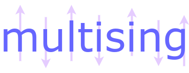
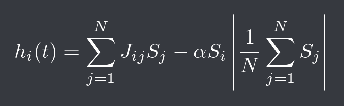
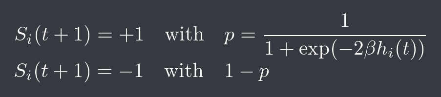
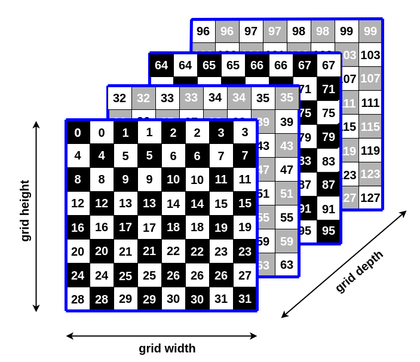
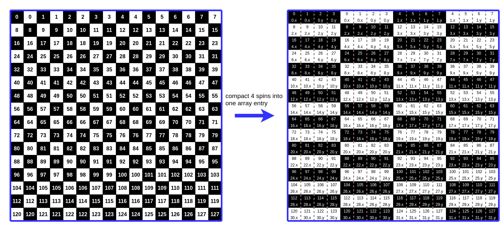
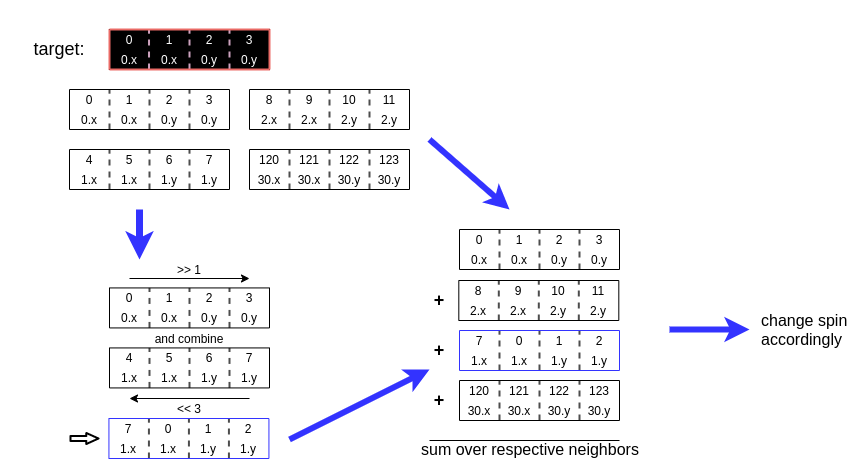

# 


Multising is an executable to simulate the ising market model with large three
dimensional spin lattices on a GPU. For [usage](#usage) see below.

## Theoretical Background

This particular model attempts to predict the behavior of traders in a market
governed by two simple guidelines:

- Do as neighbors do

- Do what the minority does

mathematically speaking is each trader represented by a spin on a three dimensional
grid. The local field of each spin *S*<sub>i</sub> is given by the equation below



where *J*<sub>ij</sub> = *j* for the nearest neighbors and 0 otherwise. The spins
are updated according to a Heatbath dynamic which reads as follows




The model is thus controlled by the three parameters

- &alpha;, which represents the tendency of the traders to be in the minority

- *j*, which affects how likely it is for a trader to pick up the strategy of its neighbor

- &beta;, which controls the randomness

For &alpha; = 0 the model is equivalent to the ising model.

(For more details see <a href="https://arxiv.org/pdf/cond-mat/0105224.pdf">
S.Bornholdt, "Expectation bubbles in a spin model of markets: Intermittency from
frustration across scales, 2001"</a>)

## Implementation

### 3D Metropolis Algorithm

The main idea behind the metropolis algorithm is to split the main lattice into
two sub-lattices with half of the original grid width. You can think of these lattices
as tiles on a chessboard (see figure below).



Each black or white tile at position p = (row, col, lattice_id) can be assigned
an individual index in a 1 dimensional array.


### Precomputation

Looking at the equation from the outline one can see, that for each iteration
there exist 14 possible values for the probability *p* which do not change across
loops.

```c++
void precompute_probabilities(float* probabilities, const float market_coupling, const float reduced_j)
{
		float h_probabilities[2][7];

		for (int spin = 0; spin < 2; spin++) {
			for (int idx = 0; idx < 7; idx++) {
				int neighbor_sum = 2 * idx - 6;
				double field = reduced_j * neighbor_sum + market_coupling * ((spin) ? 1 : -1);
				h_probabilities[spin][idx] = 1 / (1 + exp(field));
			}
		}
		CHECK_CUDA(cudaMemcpy(probabilities, &h_probabilities,
                   2 * 7 * sizeof(**h_probabilities), cudaMemcpyHostToDevice));
		return;
}
```

Instead of computing the probability for each spin individually, the kernel now only
has to find the respective value for each individual spin in the array which only
depends on the sum over the 6 neighbors and its own orientation.

### Multispin Coding Approach

Multispin coding stores spin values in individual bits rather than full bytes
leading to more efficient memory usage and thus faster computation times.
The spin values are mapped from (-1, 1) to the binary tuple (0, 1). This
allows for each spin to be resembled by an individual bit. An unsigned long
long (with size of 64 bits), for example, can store 16 spins. The remaining
bits are left untouched to enable a fast computation of the nearest neighbors
sum. Technically, only 3 bits are needed to store values up to 7, but that would
lead to more complicated edge cases. In the figure below, an example is shown
where four spins are stored in a variable indexed by x and y.



To compute the sum of the four nearest neighbors in the plane, the neighbors of
the new variable can be used. However one entry needs to be altered slightly
depending on color and row parity. By summing over the neighbors, all four nearest
neighbor sums are basically computed in parallel. The neighbors in the front and
back lattices do not need to be altered and can simply be added to the sum.



## Usage

### Compiling

#### On Ubuntu/Linux

To compile and run the executable you need to have a system with a CUDA-capable
GPU. Additionaly you need to install the cuda-toolkit as well as suitable
C/C++ compiler (e.g. gcc). If everything is set up correctly you should be able
produce the executable with the `make` command.

**Note:** You may need to adjust the `-arch` option in the Makefile according
to the compute capabilities of your GPU.

#### On Windows/Mac

Most (if not all) of the code should be cross-platform. However, it is not tested
on those platforms and correct results cannot be guaranteed. You need to compile
it manually, using the command from the Makefile.

### Running

The program expects a file "multising.conf" in the directory it is called from.
This file contains all the values for the simulation like grid size and parameters.
The path to the file can also be passed as the first argument in the terminal.

Example configuration file:

```
grid_height = 512
grid_width = 512
grid_depth = 512
total_updates = 100000
seed = 2458242462
alpha = 15.0
j = 1.0
beta = 0.6
init_up = 0.5
```
